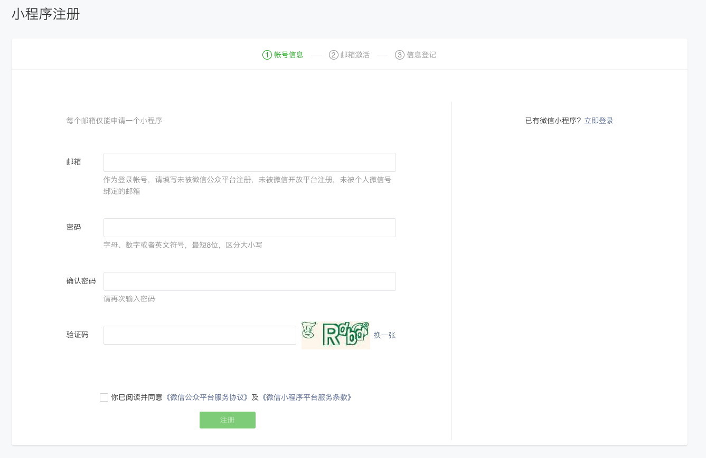
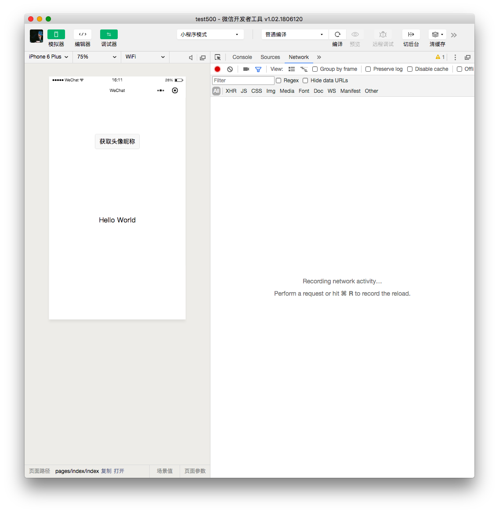

# Getting started
The very first thing you need to get started is a WeChat Mini Program account. Follow this tutorial to learn how you can get up and running!

## Applying for an account
Go to [Tencent's Mini Program portal](https://mp.weixin.qq.com/wxopen/waregister?action=step1) to apply for a WeChat mini program account. 

This dashboard will be where we manage our mini program versioning, publishing, analytics, permissions, etc. After verifying your email and completing registration, you can log in to the dashboard at [https://mp.weixin.qq.com/](https://mp.weixin.qq.com/). After logging in, navigate to `设置` -> `开发设置` to fetch the **AppID** of your mini program.

The **AppID** of your mini program is the main public identifier of the account, and is universally identified across WeChat. In short, it's important and you will be using it a lot!

::: warning 
There are some constraints on registration. Generally speaking, you need a Chinese national holder of _shenfenzheng_ to register. You can also use the *touristAppId* for studying and to get started developing.
:::

Now that we have our mini program **AppId**, we need to set up a dev environment!

## Installing the IDE
Download the official IDE (developer tools) from [Tencent's official download page](https://mp.weixin.qq.com/debug/wxadoc/dev/devtools/download.html?t=2018712).

Open the IDE, scan the QR code with WeChat mobile app, and get ready to start coding your first mini program.

## Hello world
Create a new mini program project by first choosing the purple box on the left titled `小程序项目` then tapping the `+` icon in the lower right hand corner. You will be prompted to choose a directory for your mini program code to live in by tapping on the `项目目录` input. 

Next, enter your **AppID** in the second input box.

::: tip
If you don't have an AppID, you can choose the *touristAppId* by tapping the blue text labeled `小程序` below the input for **AppID**
:::

Enter a name for your mini program project in the third input box. After entering a name for the project, you should see a green checkbox below the text input. Make sure this is checked in order to allow the IDE to create the `Quickstart` or `创建 QuickStart 项目` project for you. This will provide you with the basic boilerplate for starting your miniprogram.

Lastly, press the `确定` button to launch your new project in the IDE. You now have a mini program! You should see something like this:

Now we can start working on & compiling our mini program code in real time.

## Compiling & viewing
The IDE will watch your files and re-compile your source code in real time. You can also manually compile your source code by pressing the `编译` button on the top bar of your IDE. 

To preview your mini program inside of WeChat, you can press the `预览` button on the top bar of your IDE, then scan the QR code.

